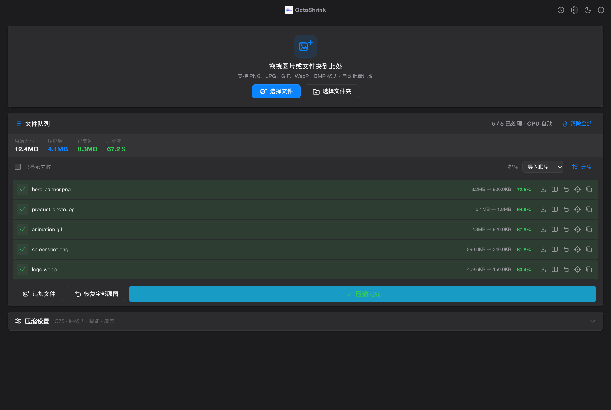

# 🐙 章小压 · OctoShrink

> **免费开源、本地运行的图片压缩工具。** 拖进去，压缩好，还给你。

[](LICENSE)
[](https://github.com/misswell/octo-shrink/releases)
[](https://tauri.app)
[](https://apps.apple.com/cn/app/octoshrink-%E5%9B%BE%E7%89%87%E5%8E%8B%E7%BC%A9/id6792604654?mt=12)


官网：**[octoshrink.liuguofeng.com](https://octoshrink.liuguofeng.com/)**

## 为什么用它

在线压缩工具很方便，但图片需要上传到第三方服务器；命令行工具很强，但需要安装和记参数；不少桌面压缩软件又比较重。章小压把常用压缩工具打包进一个轻量桌面应用里，适合每天处理截图、设计稿、公众号配图、网站图片和产品素材。

- **图片不上云**：所有压缩都在本机完成，断网也能用
- **拖拽批量压缩**：支持图片和文件夹，自动递归处理子目录
- **开箱即用**：内置 pngquant、oxipng、mozjpeg、gifsicle、cwebp、avifenc
- **体积轻**：Tauri 2 + Rust 后端，macOS DMG 约 14–16MB（Universal 约 29MB），沙盒版仅约 5.6MB
- **可视化对比**：独立对比窗口，滑动查看压缩前后效果，按需重调质量再压一次
- **原图保护**：覆盖原文件前先保存一份真正原图，压缩历史跨启动保留，任何时候都能一键恢复

## 适合谁

- 写博客、公众号、知识库时，经常需要压缩配图的人
- 前端、独立开发者、站长，需要减少网页图片体积的人
- 设计师、运营、产品经理，需要批量处理截图和素材的人
- 不想把证件照、合同扫描件、客户图片上传到在线工具的人

## 📸 截图

| 亮色模式 | 暗黑模式 |
|---------|---------|
|  |  |


## ✨ 特性

### 压缩

- 🎯 **两种处理方式**：「高级压缩」按格式与质量参数精调；「系统转换」直接调用 macOS 自带转换能力，行为对齐 Finder 右键「快速操作 → 转换图像」
- 🚀 **多引擎**：PNG（pngquant 有损 / oxipng 无损）、JPEG（cjpeg · mozjpeg）、GIF（gifsicle）、WebP（cwebp）、AVIF（avifenc），并以 Rust `image` 引擎作后备
- 🔄 **智能算法选择**：自动分析图片格式，从多个后端中挑合适的算法；也可手动指定引擎
- 📦 **批量处理**：批量选图或拖入整个文件夹，自动递归子目录；队列支持追加、去重、失败筛选、列排序与重试
- 🔄 **格式转换**：可输出为保持原格式、JPEG、PNG、WebP、AVIF（macOS 系统转换另支持 HEIF）
- 📁 **三种输出模式**：覆盖原文件、加自定义文件名后缀（默认 `_compressed`）、输出到指定文件夹
- 📊 **实时对比**：压缩前后体积、压缩率一目了然；对比是独立原生窗口，可自由放大到超过主窗口
- 🖥️ **在线更新**：macOS 直发版内置签名校验的更新检查，发现新版本由你确认下载

### 原图安全

- ↩️ **恢复原图**：覆盖模式下先备份再写盘，不满意可恢复原始文件；若文件在压缩后又被外部改动过，会先确认再覆盖
- 🕘 **压缩历史**：独立「历史」页按时间倒序列出文件名、原始 → 压缩后体积、节省比例、时间、算法与状态，可直接从历史恢复原图（队列和压缩进度不受影响）
- 🗓️ **备份保留期**：默认「不保留」——覆盖前照样先备份，本次会话内随时可恢复原图，关闭应用时清干净；也可改为 1 / 3 / 7 / 14 / 30 天，过期的历史记录与备份在下次启动时自动清理，**任何时候都不会删除你的图片或压缩结果**
- 🧾 **崩溃安全**：每次覆盖前先落一份事务凭证，中途崩溃或强杀会在下次启动自动补记或回滚；历史记录文件损坏时先隔离现场、按备份重建可恢复条目，并跳过本次清理——宁可少删，不可错删
- ⏸️ **安全暂停**：压缩途中可暂停 / 继续，只拦下还没开始的文件，正在处理的那张不会被打断

### 其他

- 🔒 **本地优先**：无账号、无遥测，图片不进任何服务器；断网照常工作（直发版的更新检查只访问 GitHub Releases）
- 🔧 **内置工具链**：CLI 压缩工具与依赖库已打包进应用，无需用户额外安装
- ⚙️ **CPU 使用上限**：设置页「性能」可限制同时使用的 CPU 并行能力（自动 / 1…本机并行度），队列摘要显示 `· CPU 4/10`。数值越低速度越慢，但给其他应用留出更多性能；运行中改数值不打断正在压缩的文件，暂停与它共用同一套调度闸门
- 🖤 **暗黑模式**：自动 / 亮色 / 暗黑三档
- 🔓 **完全免费**：MIT 开源协议，无需购买激活码

> 📌 上面「恢复原图 / 压缩历史 / 备份保留期 / 崩溃安全 / 安全暂停 / CPU 使用上限」自 **v2.5.34** 起随 GitHub Releases 发布；App Store 2.4.3 尚不包含。

## 📦 下载与安装

| 渠道 | 最新版本 | 适合谁 | 获取方式 |
|------|---------|--------|---------|
| [GitHub Releases](https://github.com/misswell/octo-shrink/releases) | v2.5.34 | 想要最新版、Windows / Linux 用户 | 下载 DMG / 安装包，直发版支持在线更新 |
| [Mac App Store](https://apps.apple.com/cn/app/octoshrink-%E5%9B%BE%E7%89%87%E5%8E%8B%E7%BC%A9/id6792604654?mt=12) | 2.4.3 | 只想省心安装与自动更新的 Mac 用户 | 搜索「OctoShrink 图片压缩」，免费 |

> 两条分发线的版本号各自独立递增，因此会出现 App Store 版号低于 GitHub 版的情况；功能差异见下方「三条产物线」。

GitHub Releases 提供：macOS Universal 2 / Apple Silicon / Intel 三种 DMG（均已 Developer ID 签名 + 公证 + 装订），Windows `.exe` / `.msi`，Linux `.deb` / `.AppImage`。

### 本次发布（v2.5.34）

压缩历史与原图长期备份、统一恢复服务、覆盖事务与崩溃回滚、历史文件损坏自保、按保留天数自动清理、安全暂停、三线共用的 CPU 使用上限（同时限制并发文件数与单个编码器内部线程数）、沙盒版跨启动文件访问授权、Swift 原生线补齐到与 Tauri 版功能对齐，以及官网改版。

### 基本使用

1. 打开章小压
2. 拖入图片或文件夹
3. 选处理方式：「高级压缩」（可调格式、质量、引擎）或 macOS「系统转换」
4. 选择输出模式：覆盖原文件、添加自定义文件名后缀（默认 `_compressed`），或输出到指定文件夹
5. 点击「开始压缩」；中途想停下来点「暂停」，处理完当前这张就会停住，随时「继续」
6. 如需检查画质，点「对比」在独立窗口里滑动查看压缩前后差异，可重调质量再压一次
7. 想找回某张的原图：标题栏「历史」→ 定位该文件 → 「恢复原图」
8. 想给其他应用留性能：「设置」→「性能」→ 调 CPU 使用上限，或直接点「自动」

### macOS 提示“已损坏，无法打开”

> 自 v2.2 起已使用 **Apple Developer ID 签名 + 公证（Notarization）+ 装订（Stapling）**，正常双击安装即可运行，**不再需要**下面的 xattr 处理。
>
> 下面这段仅用于调试旧版本（未签名）时参考。

如果使用旧版（未签名）下载安装后打开提示：

> "OctoShrink.app"已损坏，无法打开。你应该推出磁盘映像。

这通常不是文件真的损坏，而是 macOS 对未签名/未公证开源应用添加了隔离标记。可以这样处理：

1. 打开 `.dmg`
2. 将 `OctoShrink.app` 拖到「应用程序」文件夹
3. 推出/弹出磁盘映像
4. 打开「终端」，运行：

```bash
sudo xattr -dr com.apple.quarantine /Applications/OctoShrink.app
```

5. 再从「应用程序」里打开 OctoShrink（仅旧版需要）

## 和在线工具相比

| 能力 | 章小压 | 在线压缩工具 | 命令行工具 |
|------|--------|--------------|------------|
| 本地运行 | ✅ | ❌ | ✅ |
| 图片不上云 | ✅ | ❌ | ✅ |
| 批量文件夹处理 | ✅ | 通常受限 | 需要脚本 |
| 开箱即用 | ✅ | ✅ | 通常需要安装 |
| 可视化对比 | ✅ | 部分支持 | ❌ |
| 原图备份与恢复 | ✅ | ❌ | ❌ |
| 开源免费 | ✅ | 部分免费 | 多数免费 |

## 🏗️ 技术架构

基于 **Tauri 2** 构建，后端 Rust，前端原生 HTML/CSS/JS（无构建步骤）。另有第三条 **Swift 原生** 产品线。macOS 要求 11.0+（App Store 版 12.0+）。

### 三条产物线

同一套源码、同一个 master 分支，靠 Cargo feature 分叉：

| 产物线 | 对应分发 | 压缩后端 | 构建脚本 | 产物 |
|--------|---------|---------|---------|------|
| Direct（直发） | GitHub Releases | 内置 CLI 工具（`cli-backends`，默认） | `scripts/notarize.sh` | `.app` + `.dmg` |
| App Store | Mac App Store | 全进程内 Rust 库（`appstore` = `inproc-backends`），沙盒 | `scripts/build_appstore.sh` | `.app` + `.pkg` |
| Swift 原生 | 源码 / 自行打包 | 同为进程内实现 | `scripts/build_swift.sh`、`scripts/package_swift_dmg.sh` | `.app` + `.dmg` |

日常开发用 `bash scripts/build_all.sh` 一次构建前两条线（Direct 产物重命名为 `OctoShrink_direct.app` 以免覆盖）。

- 沙盒版不打包任何第三方 CLI 或 dylib，也不 spawn 外部进程 —— 沙盒下子进程拿不到 security-scoped 文件授权，那条路径必然失败；构建脚本与源码自检测试共同守住这一点
- 沙盒版用 security-scoped bookmark 记住用户授权过的路径，所以「关闭 App → 重新打开 → 从历史页恢复原图」仍然可用；前端由进程内本地 HTTP 服务器提供（macOS 沙盒阻止 `tauri://`）
- 三条线的历史记录与备份**存储根互相独立**，不读写对方的 `history.json`；原图备份永不落临时目录

### 压缩引擎对照

| 格式 | Direct（CLI） | App Store（进程内 crate） | 后备 |
|------|--------------|--------------------------|------|
| PNG | pngquant（有损）/ oxipng（无损） | imagequant / oxipng | Rust `image` |
| JPEG | cjpeg (mozjpeg) | mozjpeg | Rust `image` |
| WebP | cwebp | webp | Rust `image` |
| AVIF | avifenc | ravif | — |
| GIF | gifsicle（可减色） | image crate 重编码（不减色） | — |
| HEIF / 系统转换 | macOS ImageIO + CoreGraphics（三线共用，对齐 Finder） | 同左 | — |
| JPEG XL | cjxl（引擎代码保留，界面输出选项已移除，两版一致） | 暂无 | — |

### 内置工具（仅 Direct 版）

所有 CLI 工具及其依赖库均已打包到应用内（`Contents/Resources/bin/` 和 `Contents/Resources/lib/`），通过 `DYLD_FALLBACK_LIBRARY_PATH` 环境变量加载，**无需用户安装任何依赖**。

## 🛠️ 开发

### 环境要求

- [Rust](https://rustup.rs/) 1.77+
- [Tauri CLI](https://tauri.app/) (`cargo install tauri-cli --version "^2.0"`)
- CLI 压缩工具（开发时需要，macOS 可通过 Homebrew 安装）：

```bash
brew install pngquant oxipng mozjpeg gifsicle webp jpeg-xl libavif
```

### 开发运行

```bash
# 开发模式
cargo tauri dev

# 或直接运行（无需 Tauri CLI）
cd src-tauri && cargo run

# 构建发布版本
cargo tauri build

# 一次构建两条 Tauri 产物线（日常首选，不签名）
bash scripts/build_all.sh
SIGN=1 bash scripts/build_all.sh   # 同时签名

# 将 CLI 工具打包到 .app（开箱即用）
bash scripts/package.sh
```

### 分发打包（Apple 签名 + 公证）

`scripts/notarize.sh` 一键完成「构建 → 复制内置工具 → 逐个签名（hardened runtime + entitlements）→ 校验 → 制作 DMG → Apple 公证 → 装订票据」。

前置条件（只需做一次）：

1. 加入付费 [Apple Developer Program](https://developer.apple.com/programs/)，并创建 **Developer ID Application** 证书（在 Xcode 账户或 developer.apple.com 创建，安装到登录钥匙串）。
   - 验证：`security find-identity -v -p codesigning` 能看到 `Developer ID Application: ... (你的 Team ID)`。
2. 存储公证凭据（推荐 keychain profile，免明文密码）：
   ```bash
   xcrun notarytool store-credentials "octoshrink-notary" \
     --apple-id "you@example.com" --team-id "你的TeamID" \
     --password "应用专用密码"   # 在 appleid.apple.com 生成
   ```

打包发布：

```bash
# 自动检测 Developer ID 身份；使用 keychain profile 公证
NOTARY_PROFILE="octoshrink-notary" bash scripts/notarize.sh

# 或用 Apple ID + 应用专用密码公证
APPLE_ID="you@example.com" APPLE_APP_SPECIFIC_PASSWORD="xxxx-xxxx-xxxx-xxxx" \
  APPLE_TEAM_ID="你的TeamID" bash scripts/notarize.sh

# 仅签名不公证（本地测试）
SIGN_ONLY=1 bash scripts/notarize.sh

# App Store 线：构建 → 签名 → productbuild 打 PKG
bash scripts/build_appstore.sh
```

产物：
- `src-tauri/target/release/bundle/macos/OctoShrink.app`（已签名 + 装订）
- `src-tauri/target/release/bundle/macos/OctoShrink-<version>-macos.dmg`（已签名 + 装订）

> 说明：内置的 7 个 CLI 压缩工具与 17 个动态库均已用 Developer ID 逐一签名，并启用 hardened runtime 与 `disable-library-validation` / `allow-dyld-environment-variables` entitlements，以确保 `DYLD_FALLBACK_LIBRARY_PATH` 在加固运行时下仍可加载内置库。这是通过 Apple 公证的必要条件。

也可以推 `vX.Y.Z` 标签、或在 GitHub 手动运行 **Release** workflow（`.github/workflows/release.yml`）：CI 会并行构建 ARM / Intel / Universal 2 / Windows / Linux，逐一签名、公证三个 macOS DMG，签好 Universal 在线更新包并生成 `latest.json`。手动运行时 `publish=false`（默认）只完整验证构建、签名与公证，`publish=true` 才正式发布。

### 项目结构

```
octoshrink/
├── frontend/               # 前端（纯 HTML/CSS/JS，无构建步骤）
│   ├── index.html          # 主窗口
│   ├── compare.html        # 独立对比窗口
│   ├── compare_window.js   # 对比窗口逻辑（载荷经后端状态中转）
│   ├── app.js              # 使用 window.__TAURI__ 全局 API
│   └── style.css
├── src-tauri/              # Rust 后端（两条 Tauri 产物线共用）
│   ├── src/
│   │   ├── main.rs              # 入口
│   │   ├── lib.rs               # Tauri 应用配置（沙盒线含本地 HTTP 服务器）
│   │   ├── engine.rs            # 压缩引擎（CLI 后端）
│   │   ├── engine_inproc.rs     # 压缩引擎（进程内后端，不 spawn 外部进程）
│   │   ├── commands.rs          # Tauri 命令 + CompressionScheduler（暂停与并发预算）
│   │   ├── history.rs           # 压缩历史 + 原图备份 + 统一恢复服务
│   │   ├── output_transaction.rs# 覆盖事务凭证，启动时补记或回滚
│   │   ├── sandbox_access.rs    # 跨启动文件访问授权（书签 / 直通）
│   │   ├── app_settings.rs      # 备份保留天数 + CPU 并行上限（同一份 settings.json）
│   │   └── system_info.rs       # CPU 能力检测（并行度基准 + 核心构成展示）
│   ├── resources/bin|lib/       # 内置 CLI 工具与动态库（仅 Direct 版打包）
│   ├── capabilities/default.json# IPC 权限（沙盒版必须显式声明）
│   ├── permissions/commands.toml
│   ├── entitlements*.plist      # Direct / App Store
│   └── tauri.conf*.json         # Direct / App Store 两份配置
├── swift/                  # Swift 原生线（功能对齐，独立存储根）
│   └── Sources/OctoShrinkSwift/{Engine,Models,Services,ViewModels,Views}
├── tests/                  # 前端纯逻辑自检（*.cjs，node 直接跑）
├── scripts/                # build_all / notarize / build_appstore / build_swift / 自检
├── website/                # 官网（octoshrink.liuguofeng.com）
├── docs/                   # App Store 迁移蓝图、界面设计稿
├── AGENTS.md               # 工程准则：两条产物线的并行规则、文件访问差异表
└── package.json
```

### 跑测试

```bash
cargo test                                              # Rust 默认 feature（Direct / cli-backends）
cargo test --no-default-features --features inproc-backends   # App Store 版
npm run test:frontend                                   # 前端队列 / 暂停 / 历史页 / 恢复 / CPU 上限
bash scripts/test_swift_history.sh                      # Swift 线历史·备份·暂停·CPU 上限（真跑文件系统与并发）
```

改动若涉及产物线结构、文件访问差异、entitlements 或 CLI↔crate 映射，请同步更新 `AGENTS.md` 对应小节。

## 📄 License

MIT

---

## 👨‍💻 作者的其他开源项目

**[MacPilot](https://github.com/misswell/MacPilot)** —— 开源 macOS 菜单栏效率工具箱（Swift 原生 · 零第三方依赖）：应用自动退出规则、BLE 靠近解锁、窗口切换器、剪贴板历史、平滑滚动、画中画、录屏、截图贴图等 11 合 1，Apple 公证签名，[免费下载](https://github.com/misswell/MacPilot/releases/latest)。觉得有用欢迎点个 Star ⭐
