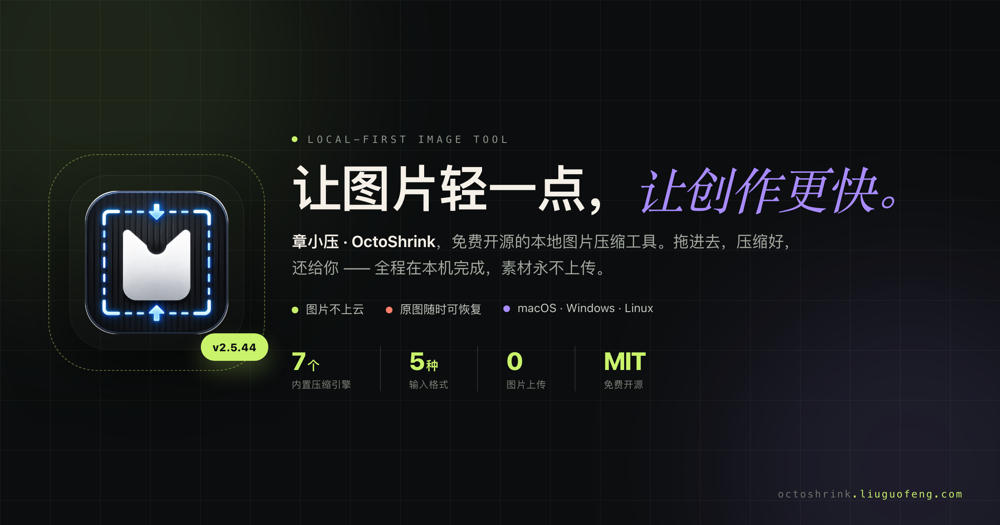
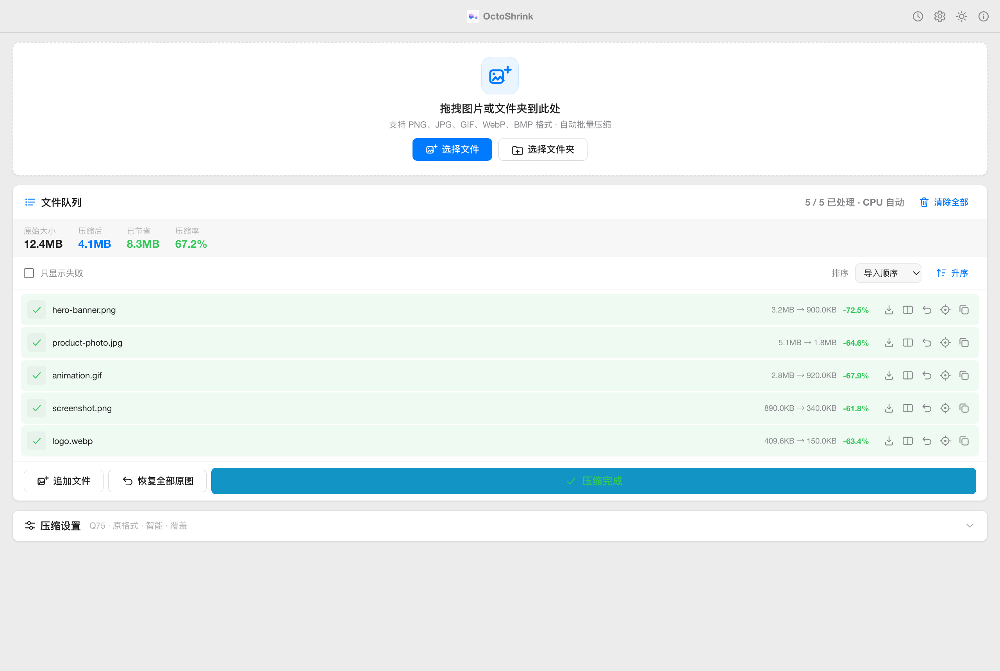
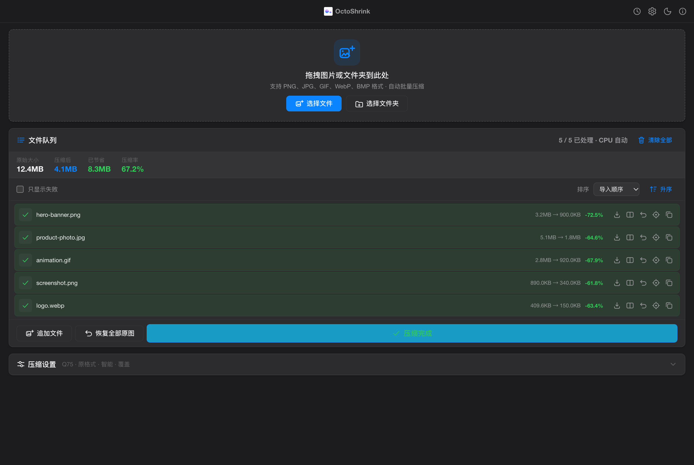
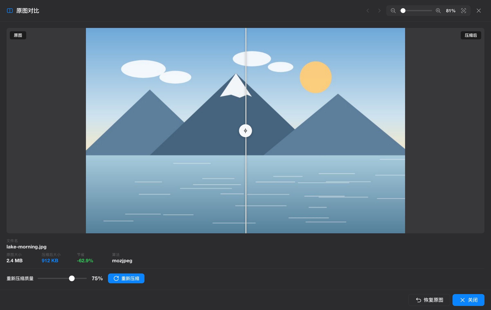

<div align="center">

# OctoShrink — Local Image Compressor

**Free, open-source desktop image compression — drop files in, get smaller files back.**

[English](README.md) · [简体中文](README.zh-CN.md)

[](https://github.com/misswell/octo-shrink/releases/latest)
[](https://github.com/misswell/octo-shrink/releases/latest)
[](LICENSE)
[](https://tauri.app)
[](https://apps.apple.com/cn/app/octoshrink-%E5%9B%BE%E7%89%87%E5%8E%8B%E7%BC%A9/id6792604654?mt=12)



**[Website](https://octoshrink.liuguofeng.com/)** · **[Latest release](https://github.com/misswell/octo-shrink/releases/latest)** · **[Mac App Store](https://apps.apple.com/cn/app/octoshrink-%E5%9B%BE%E7%89%87%E5%8E%8B%E7%BC%A9/id6792604654?mt=12)** · **[Report an issue](https://github.com/misswell/octo-shrink/issues)**

</div>

---

OctoShrink is a free, open-source image compressor for macOS, Windows, and Linux. All compression happens on your computer: your images are never uploaded, and the app works offline.

## Why OctoShrink

Online compressors upload your images to someone else's server. Command-line tools require dependencies and memorized options. OctoShrink puts everyday image compression in a desktop app:

- **Your images stay private** — processing is local; no account, sign-in, or upload
- **Ready to use** — compression engines are bundled; no command-line tools to install
- **Batch drag and drop** — add images or folders and include nested folders automatically
- **Protects originals** — saves a real backup before overwriting and can restore it later
- **Free and open source** — MIT licensed, with no purchase or activation

## Screenshots

| Light mode | Dark mode |
|------------|-----------|
|  |  |

Compare the source and compressed image pixel by pixel in a separate window by dragging the split line:



## Features

### Compression

- **Two modes:** Advanced Compression lets you set quality, effort, and output format (keep the source format or convert to JPEG, PNG, WebP, or AVIF). On macOS, System Conversion follows Finder's image conversion workflow, with JPEG, PNG, and HEIF output, size presets, and metadata retention.
- **Smart compression:** chooses an algorithm and settings for each image. You can also select an engine and effort manually.
- **Batch queue:** recursively expands and deduplicates imported files and folders. Add more files at any time, sort by name, size, compression ratio, or status, and filter for failures.
- **Flexible output:** replace the source, add a custom suffix (default `_compressed`), or write to a chosen folder.
- **Compression statistics:** see source size, output size, savings, and compression ratio for the whole queue and each file.

### Original protection

- **Backup before replacing:** OctoShrink saves the original image locally before replacing it. If the backup cannot be saved, the replacement is skipped.
- **Restore in one click:** restore from a result or history entry. If another app changed the file after compression, OctoShrink asks before overwriting it.
- **Compression history:** records persist across launches. Each entry offers the actions that are currently available: save a copy, compare, restore the original (or remove the compressed result), reveal in Finder, and copy the log.
- **Backup retention:** the default is “Don't keep” (history and backups are cleaned up when the app quits); you can also keep them for 1, 3, 7, 14, or 30 days. Cleanup only touches OctoShrink's own history and backups, never your image files.
- **Crash safety:** replacement operations are journaled. After an unexpected exit, the next launch completes or rolls back the interrupted operation. If history is damaged, OctoShrink preserves the evidence, rebuilds recovery entries from backups, and skips cleanup for that run.

### Queue and jobs

- **Pause, resume, and stop:** pause waits for files that have not started while current compression finishes. Stop ends the current pass and leaves the remaining files queued; Resume continues from there without losing progress. Retry failed files individually.
- **CPU limit:** choose automatic scheduling or limit parallel work (files at once × encoder threads) to leave capacity for other apps.
- **Automatic processing:** optionally start compression as soon as files are imported. After changing settings, you can also recompress an individual file.

### Interface

- 🌗 Light, dark, or system appearance; compression settings are collapsed by default.
- 🌐 English and Simplified Chinese. The interface follows the system language by default, and you can choose a language in Settings.
- 🔄 The macOS direct-download edition checks for updates in the app; the Mac App Store edition updates through the store.
- 🔒 The direct-download macOS app is Developer ID signed and notarized.

## Download and install

| Channel | Best for | How to get it |
|---------|----------|---------------|
| [GitHub Releases](https://github.com/misswell/octo-shrink/releases/latest) | Latest features, Windows, and Linux | Download and install the package for your platform |
| [Mac App Store](https://apps.apple.com/cn/app/octoshrink-%E5%9B%BE%E7%89%87%E5%8E%8B%E7%BC%A9/id6792604654?mt=12) | Mac users who prefer store installation and updates | Search for “OctoShrink Image Compressor”; it is free |

GitHub Releases provides macOS Apple Silicon, Intel, and Universal DMGs; Windows installers (EXE/MSI); and Linux packages (AppImage/DEB). The two distribution channels are reviewed and released independently, so their versions and release dates can differ slightly.

### Quick start

1. Open OctoShrink and drop images or folders into the window, or choose **Choose Files** / **Choose Folder**.
2. Expand **Compression settings** to adjust quality, effort, format, and output location. Otherwise, start with the defaults.
3. Select **Start compression**. You can pause, stop, or add files at any time; failed files can be retried individually.
4. Select **Compare** on a result row to inspect the source and output in a separate window. If needed, adjust quality and recompress.
5. In Replace mode, restore the original at any time. The **History** page also provides earlier records.
6. In **Settings**, adjust backup retention, the CPU limit, appearance, and language.

### macOS says “damaged and can't be opened”

Since v2.2, the direct-download edition has been signed, notarized, and stapled, so a normal install should open without this warning. For older, unsigned versions, you can remove the quarantine attribute in Terminal:

```bash
sudo xattr -dr com.apple.quarantine /Applications/OctoShrink.app
```

## Compared with online and command-line tools

| Capability | OctoShrink | Online compressors | Command-line tools |
|------------|:----------:|:------------------:|:------------------:|
| Images stay on your device | ✅ | ❌ | ✅ |
| Recursive folder batches | ✅ | Usually limited | Requires a script |
| Ready to use | ✅ | ✅ | Usually requires installation |
| Visual before-and-after comparison | ✅ | Sometimes | ❌ |
| Original backup and one-click restore | ✅ | ❌ | ❌ |
| Works offline | ✅ | ❌ | ✅ |
| Free and open source | ✅ | Some are free | Most are free |

## Technical architecture

OctoShrink uses **Tauri 2** (a Rust backend with a native HTML/CSS/JavaScript frontend and no frontend build step) and also has a third, **native Swift** distribution. Minimum macOS versions: 11.0 for Direct, 12.0 for App Store, and 13.0 for Swift Native.

### Three distribution tracks

The Direct and App Store editions share one source tree and `master` branch, with Cargo features selecting their backends:

| Track | Distribution | Compression backend | Build script | Package |
|-------|--------------|---------------------|--------------|---------|
| Direct | GitHub Releases | Bundled CLI tools (`cli-backends`, the default) | `scripts/notarize.sh` | `.app` + `.dmg` |
| App Store | Mac App Store | In-process Rust libraries (`appstore` = `inproc-backends`), sandboxed | `scripts/build_appstore.sh` | `.app` + `.pkg` |
| Swift Native | Source / manual packaging | Bundled CLI encoders shared with Direct; ImageIO for system conversion | `scripts/build_swift.sh` | `.app` + `.dmg` |

- The App Store edition does not package or launch third-party executables. It uses in-process Rust libraries for all formats, serves the frontend through a local HTTP server (the sandbox blocks `tauri://`), and accesses user files through security-scoped bookmarks.
- Swift Native and Direct share six encoders: pngquant, oxipng, cjpeg, cwebp, avifenc, and gifsicle. Builds verify that the encoders are present, and Smart Mode uses the same defaults.
- Each distribution track has its own history and backup root. Original backups are never stored in temporary folders.
- Engineering rules are documented in [AGENTS.md](AGENTS.md), including the parallel distribution tracks, file-access differences, and entitlements.

### Compression engine comparison

| Format | Direct (CLI) | App Store (in-process crates) | Swift Native (CLI) |
|--------|--------------|-------------------------------|--------------------|
| PNG | pngquant / oxipng | imagequant / oxipng | Shared binaries with Direct |
| JPEG | cjpeg (mozjpeg) | mozjpeg | cjpeg (mozjpeg) |
| WebP | cwebp | webp | cwebp |
| AVIF | avifenc | ravif | avifenc |
| GIF | gifsicle (color reduction) | image crate re-encoding | gifsicle (color reduction) |
| System conversion | macOS ImageIO + CoreGraphics | Same | Same |

The CLI tools and libraries required by Direct and Swift Native are bundled in each app's `Contents/Resources/bin|lib` and loaded with `DYLD_FALLBACK_LIBRARY_PATH`; users do not need to install dependencies. The App Store edition does not include these files.

## Development

### Requirements

- [Rust](https://rustup.rs/) 1.77+ and [Tauri CLI](https://tauri.app/) 2.x (`cargo install tauri-cli --version "^2.0"`)
- CLI compression tools for development (release apps bundle them for users):

```bash
brew install pngquant oxipng mozjpeg gifsicle webp jpeg-xl libavif
```

### Common commands

```bash
cargo tauri dev                 # Development mode (Direct feature by default)

bash scripts/build_all.sh       # Build Direct + App Store editions (recommended, unsigned)
SIGN=1 bash scripts/build_all.sh

cargo tauri build               # Build the Direct release edition
bash scripts/notarize.sh        # Direct: build, sign, notarize, staple, and package a DMG
bash scripts/build_appstore.sh  # App Store: build, sign, and package a PKG

# Tests (run locally before publishing)
cargo test                                                    # Default Rust feature
cargo test --no-default-features --features inproc-backends   # App Store feature
npm run test:frontend                                         # Frontend queue, state, history, and CPU-limit checks
bash scripts/test_swift_history.sh                            # Swift history, backup, and pause checks
```

Pushing a `vX.Y.Z` tag starts GitHub Actions to build and publish the platform packages. Signing and notarization setup is documented in [AGENTS.md](AGENTS.md), section 14.

### Project structure

```
octo-shrink/
├── frontend/                       # Frontend (plain HTML/CSS/JS; no build step)
│   ├── index.html / app.js          # Main window
│   └── compare.html / compare_window.js  # Separate comparison window
├── src-tauri/                       # Rust backend shared by both Tauri tracks
│   ├── src/
│   │   ├── engine.rs               # Compression engine (CLI backend)
│   │   ├── engine_inproc.rs        # In-process engine (does not spawn processes)
│   │   ├── commands.rs             # Tauri commands and CompressionScheduler
│   │   ├── history.rs              # History, backups, and restore service
│   │   ├── output_transaction.rs   # Replacement journal and crash recovery
│   │   └── app_settings.rs         # Retention and CPU limit settings
│   ├── resources/bin|lib/           # CLI tools and libraries for Direct / Swift
│   ├── entitlements*.plist          # Direct / App Store entitlements
│   └── tauri.conf*.json             # Direct / App Store configurations
├── swift/                           # Native Swift edition with its own storage root
├── website/                         # Website (octoshrink.liuguofeng.com)
├── tests/                            # Frontend checks (run directly with Node.js)
├── scripts/                          # Build, signing, notarization, and verification
└── AGENTS.md                         # Engineering rules and distribution-track requirements
```

## License

[MIT](LICENSE)

---

## Other open-source projects by the author

**[MacPilot](https://github.com/misswell/MacPilot)** — an open-source native macOS menu-bar toolkit with zero third-party dependencies. It combines app auto-quit rules, BLE proximity unlock, window switching, clipboard history, smooth scrolling, picture-in-picture, screen recording, screenshot pinning, and more. [Download for free](https://github.com/misswell/MacPilot/releases/latest); stars are always welcome ⭐
