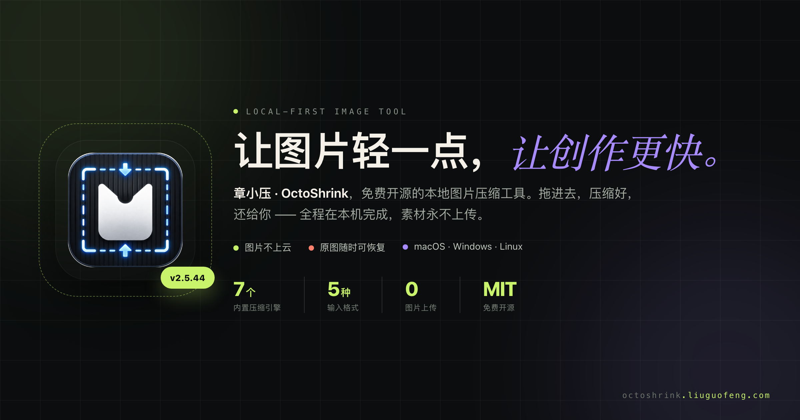
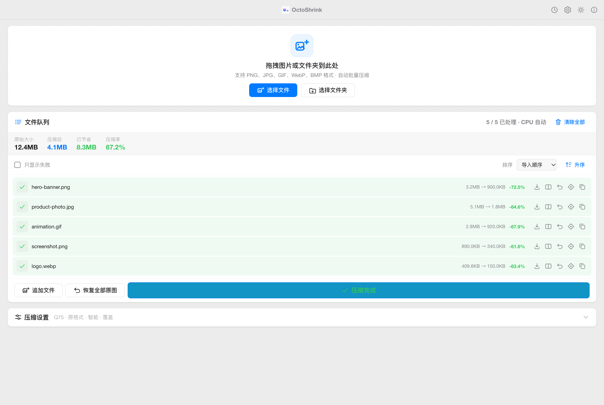
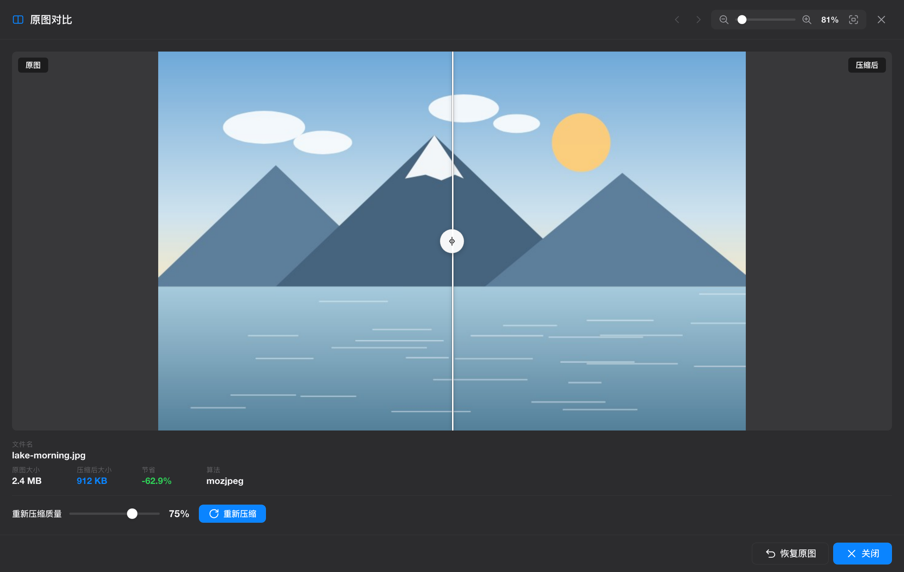

# 章小压：一个免费开源、本地运行的图片压缩工具

如果你经常写博客、发公众号、做产品页面，应该都遇到过这种小麻烦：图片看起来没问题，上传时却提示体积太大；网页打开慢，最后发现是几张截图或 Banner 把流量吃掉了。

我做了一个桌面工具来解决这件事：**章小压（OctoShrink）**。它是一个免费开源、本地运行的图片压缩工具，核心用法很简单：

**拖进去，压缩好，还给你。**

<!--more-->

## 为什么又做一个图片压缩工具

图片压缩不是新需求，工具也不少。但我自己用下来，总会遇到几个不舒服的地方：

- 在线工具需要上传图片，遇到证件照、合同截图、客户素材时不太放心
- 命令行工具效果很好，但安装、参数、脚本对很多人来说太麻烦
- 一些桌面工具体积较大，或者只覆盖单个平台
- 批量压缩、对比画质、恢复原图这些细节经常不够顺手

章小压想做的是一个更直接的版本：打开应用，拖入图片或文件夹，点一下开始压缩。如果需要检查画质，就打开对比界面滑一下。

## 它能做什么

章小压支持 PNG、JPG、GIF、WebP、BMP 图片压缩，也可以输出 WebP、AVIF、JPEG XL、JPEG、PNG 等格式。它适合处理博客配图、产品截图、网页图片、公众号封面、设计稿导出图和日常素材。

几个我比较在意的功能：

**本地运行，图片不上云。**  
所有压缩都在电脑上完成，不需要上传到第三方服务器。断网也能用，处理敏感图片会安心很多。

**拖拽批量处理。**  
可以直接拖入多张图片，也可以拖入整个文件夹。章小压会递归查找子目录里的图片，批量加入队列。

**内置 7 个压缩工具。**  
应用内打包了 pngquant、oxipng、mozjpeg、gifsicle、cwebp、cjxl、avifenc，不需要用户额外安装 Homebrew、配置环境变量或学习命令行。

**智能模式。**  
默认开启智能模式，会根据图片格式和设置选择合适的压缩方式。你也可以手动调整质量、输出格式、压缩力度。

**压缩前后对比。**  
压缩完可以打开对比窗口，滑动查看原图和压缩图的差异。对画质比较敏感时，也可以在对比界面重新调节质量。

**覆盖模式也能恢复。**  
如果选择覆盖原文件，章小压会先备份原图。压缩后不满意，可以恢复单张原图，也可以一键恢复全部。

**不会把图片越压越大。**  
如果压缩后的文件没有变小，章小压会跳过写入，不会用更大的文件替换你的原图。

## 和在线压缩工具的区别

在线压缩工具最大的优点是方便，打开网页就能用。但它也有天然限制：图片要上传，压缩后再下载；文件多时效率不高；遇到私密素材时也会犹豫。

章小压更适合这些场景：

| 场景 | 为什么适合章小压 |
|---|---|
| 博客和公众号配图 | 批量拖入，快速减小体积 |
| 产品截图和设计稿 | 本地处理，避免素材上传 |
| 网站图片优化 | 支持 WebP、AVIF、JPEG XL 等输出 |
| 大量文件夹整理 | 可递归处理子目录 |
| 对画质有要求 | 支持滑动对比和重新调节质量 |

## 技术实现

章小压使用 Tauri 2 构建，后端是 Rust，前端是原生 HTML/CSS/JS。没有 React、Vue 或复杂的前端构建链。

选择 Tauri 的主要原因是轻量。应用使用系统 WebView，不需要像 Electron 那样额外带一个完整 Chromium。即使内置了多个压缩工具和依赖库，macOS 应用体积仍然可以保持在约 18MB。

压缩部分由 Rust 后端调度，内置工具链负责不同格式的实际压缩：

| 格式 | 主要工具 | 后备方案 |
|---|---|---|
| PNG | pngquant / oxipng | Rust image |
| JPEG | mozjpeg cjpeg | Rust image |
| GIF | gifsicle | - |
| WebP | cwebp | - |
| AVIF | avifenc | - |
| JPEG XL | cjxl | - |

同时，章小压也处理了一些桌面应用的小细节，比如 Windows 路径转义、CLI 静默执行、macOS 应用内工具库加载、覆盖前备份和恢复等。

## 下载

章小压是 MIT 协议开源项目，代码和安装包都在 GitHub：

[https://github.com/misswell/octo-shrink](https://github.com/misswell/octo-shrink)

下载页面：

[https://github.com/misswell/octo-shrink/releases](https://github.com/misswell/octo-shrink/releases)

安装后打开应用，拖入图片或文件夹，选择输出模式，然后点击「开始压缩」即可。

## 最后

图片压缩这件事不应该需要太多折腾。章小压想解决的就是这个小而频繁的问题：让图片变小，让流程更轻，让素材留在你自己的电脑里。

如果你也经常处理图片，可以试试看。欢迎提 Issue，也欢迎 PR。
